# Attestat module — flowcharts

От простого к сложному. Каждый уровень добавляет деталей. Если нужно понять «что вообще происходит» — читай Level 1. Если ищешь конкретный баг — спускайся ниже.

**Рендер:** GitHub, VS Code (расширение *Markdown Preview Mermaid Support*), Obsidian.

---

# Level 1 — В двух словах

Что делает модуль на самом верхнем уровне.

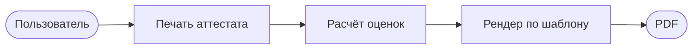

Три блока. Всё остальное — детали внутри них.

---

# Level 2 — Главные блоки

Те же 3 шага, но видно, откуда берутся данные.

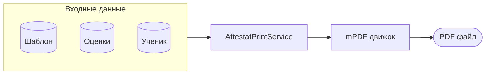

---

# Level 3 — Маршрут: клик → файл

Что происходит между нажатием кнопки и появлением PDF.

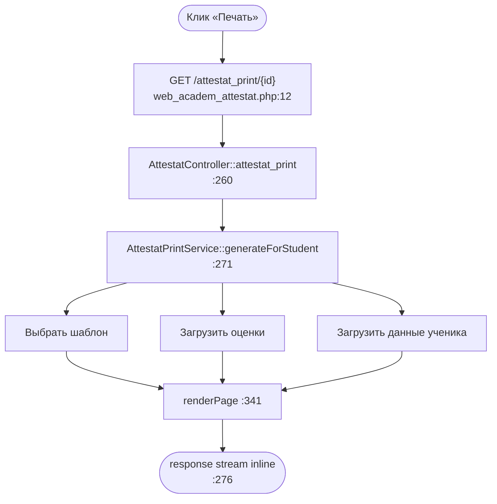

---

# Level 4 — Расчёт оценок (упрощённо)

Откуда берётся цифра в аттестате.

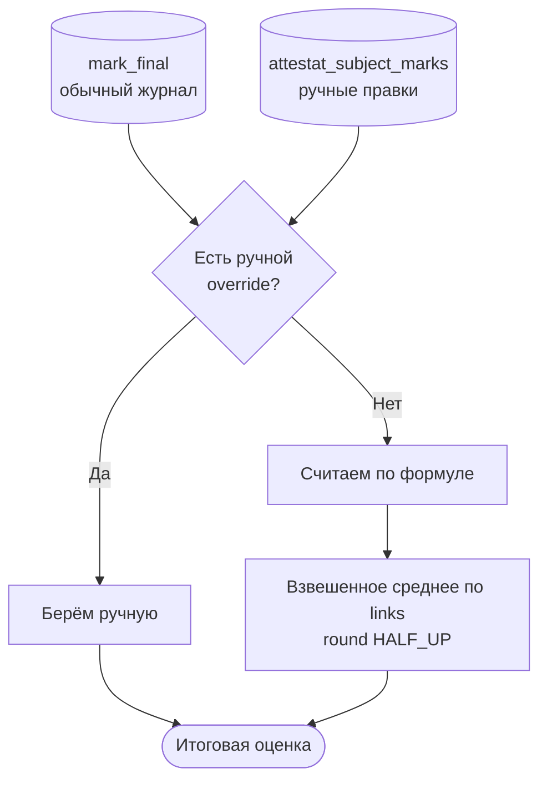

**Правило:** ручная правка разрешена **только** для предметов без `attestat_subject_links` (`AttestatMarkService.php:185`).

---

# Level 5 — Выбор шаблона (упрощённо)

5 уровней fallback. Берём первый найденный.

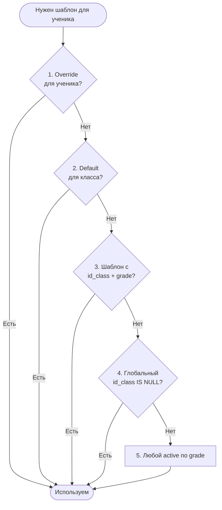

Код: `AttestatTemplateAssignmentService::assignedTemplate :105-161`.

---

# Level 6 — Конвертация размеров (упрощённо)

Главная зона багов. Превью и PDF идут разными путями.

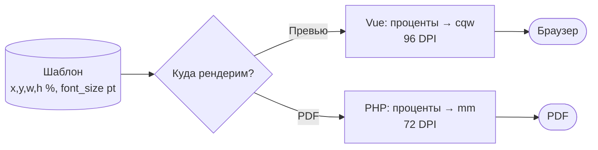

**Общая константа:** `0.35278` = `25.4 / 72` (mm в одном pt). И в JS, и в PHP.

---

# Level 7 — Полный PDF-пайплайн

Маршруты, шаблоны, шрифты, handlers — всё вместе.

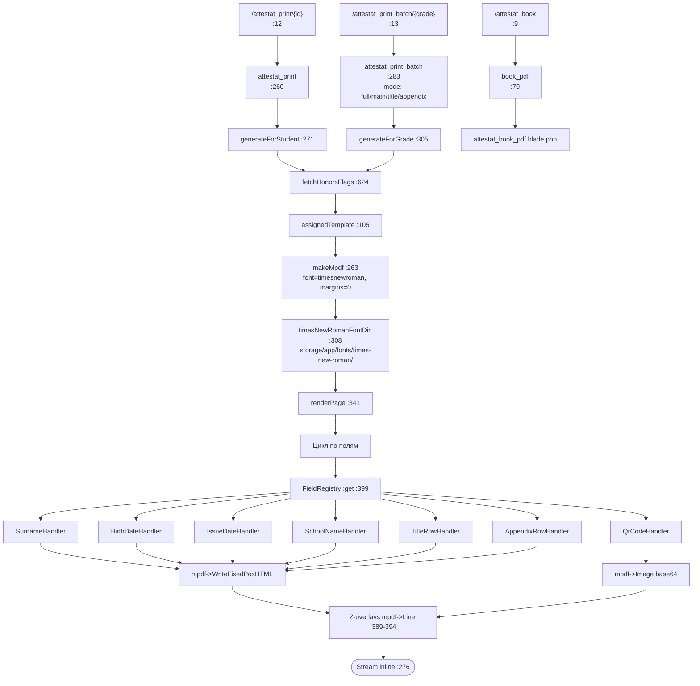

---

# Level 8 — Расчёт оценок (полная схема)

Все ветки, включая non-numeric, links, validation.

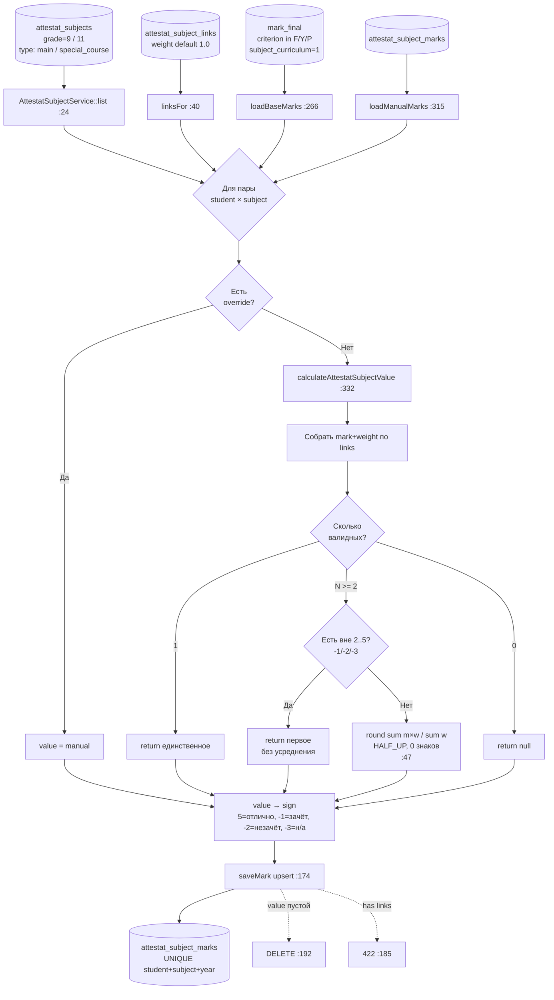

---

# Level 9 — Конвертация размеров (полная схема)

Все формулы и единицы.

**Хранение в `attestat_templates`:**
- `x, y, w, h` — проценты от размера документа
- `font_size` — pt
- `line_height` — безразмерный множитель
- `row_gap` — mm
- `doc_width_mm`, `doc_height_mm` — mm (A4 = 297×210)

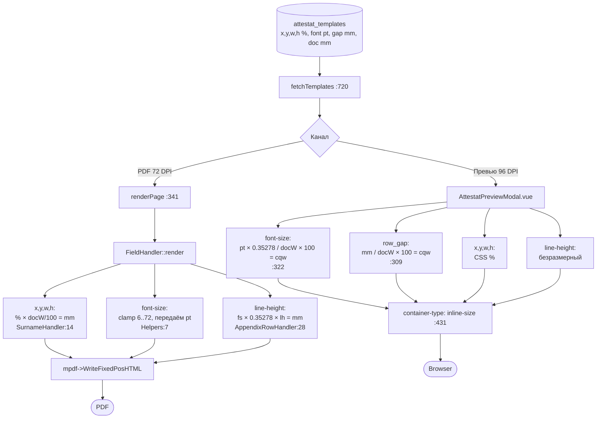

**Gotchas:**

| # | Проблема | Где смотреть |
|---|----------|--------------|
| 1 | Превью cqw vs PDF mm — при нестандартной ширине контейнера превью врёт | `AttestatPreviewModal.vue:322` |
| 2 | line-height: CSS множитель vs mPDF mm — высота строки может расходиться | `AppendixRowHandler:28` |
| 3 | Распределение приложения left/right: превью замеряет DOM, PDF — по метрикам | `AttestatPreviewModal.vue:176` vs `AttestatPrintService:592` |
| 4 | DPI: превью 96, PDF 72. Поправки нет. PDF визуально крупнее | — |
| 5 | QR: превью 200px фикс, PDF по w/h поля. Разные якоря размера | `QrCodeHandler:14` |

---

# Level 10 — Honors («с отличием»)

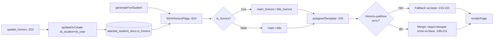

---

# Level 11 — QR-код

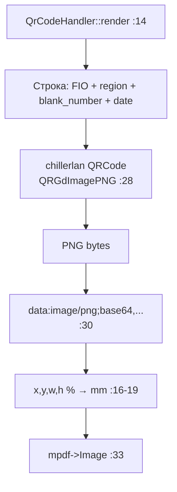

---

# Cheat-sheet файлов

| Что | Где |
|-----|-----|
| Маршруты | `routes/web_academ_attestat.php` |
| Контроллер | `app/Http/Controllers/academ/AttestatController.php` |
| Ajax | `app/Http/Controllers/academ/AttestatAjaxController.php` |
| **PDF-сервис** (главный) | `app/Services/Attestat/AttestatPrintService.php` |
| Контекст рендера | `app/Services/Attestat/AttestatRenderContext.php` |
| Helpers (метрики) | `app/Services/Attestat/Fields/AttestatRenderHelpers.php` |
| Handlers (по полю) | `app/Services/Attestat/Fields/Handlers/*.php` |
| Выбор шаблона | `app/Services/Attestat/AttestatTemplateAssignmentService.php` |
| CRUD шаблонов | `app/Services/Attestat/AttestatTemplateService.php` |
| **Расчёт оценок** | `app/Services/Attestat/AttestatMarkService.php` |
| Округление | `app/Services/Attestat/AttestatMarkCalculator.php` |
| Предметы | `app/Services/Attestat/AttestatSubjectService.php` |
| Settings (приказ, регион) | `app/Services/Attestat/AttestatSettingsService.php` |
| **Vue превью** | `resources/js/modules/academ/attestat/components/AttestatPreviewModal.vue` |
| Vue app | `resources/js/modules/academ/attestat/components/AttestatApp.vue` |
| Книга регистраций PDF | `resources/views/academ_attestat/attestat_book_pdf.blade.php` |
